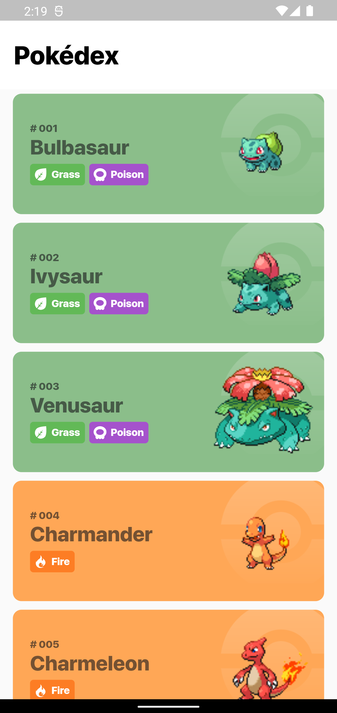
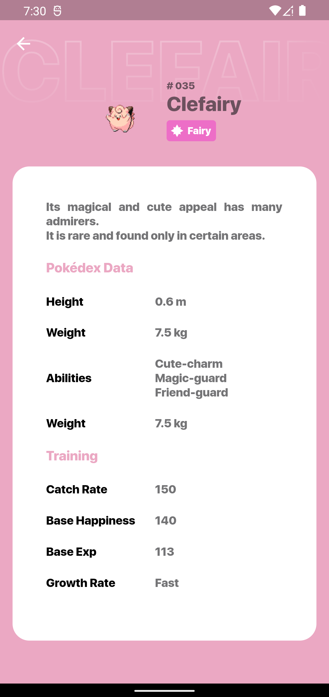
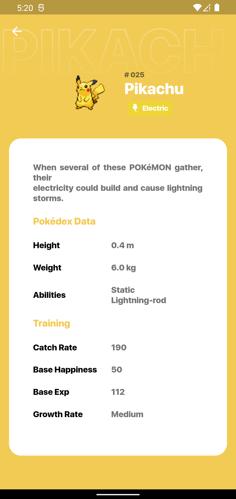
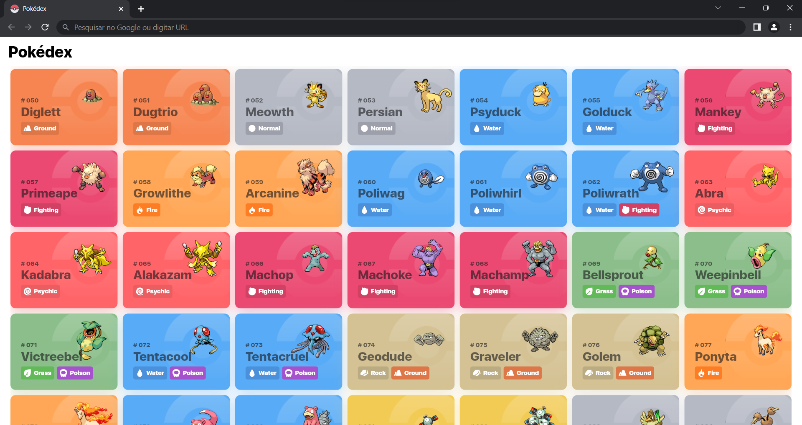

# 📱 Pokédex
## Sobre o projeto

O Aplicativo consome a api PokeApi e retorna uma lista com os pokemons e seus dados, seu layout é inspirado no design criado por [Flavio Farias](https://farias.design) e compartilhado no [Figma](https://www.figma.com/file/THLxZSlOoUYMZrjFg0Kl1M/Pokédex?node-id=18241%3A2789) .

## Layout 

### Tecnologias 

* Flutter
* API PokéApi [PokeApi](https://pokeapi.co)
* Bloc

### Desenvolvedora

Jusy Lopes
https://www.linkedin.com/in/jusylopes
